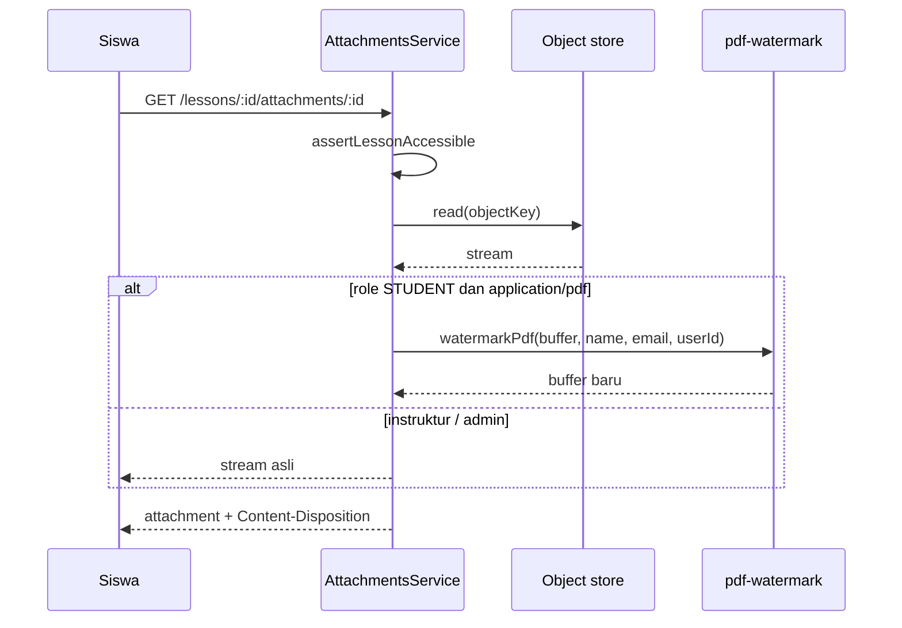

# Watermark materi PDF

Materi pelajaran (PPT, PPTX, PDF, DOCX) disimpan **tanpa** watermark. Watermark diterapkan **saat unduh**, sehingga file asli instruktur tetap bersih dan setiap salinan siswa dapat dilacak.

## Ruang lingkup saat ini

| Format | Unduhan siswa | Catatan |
|--------|---------------|---------|
| PDF | Ya — footer + cap diagonal | `pdf-lib`, di memori |
| PPT / PPTX / DOCX | Belum | Konversi berat; fase berikutnya atau kebijakan “PDF saja untuk materi sensitif” |

Video tetap memakai HLS + overlay watermark di pemutar (terpisah dari lampiran).

## Alur unduh

## Isi watermark PDF

- **Footer setiap halaman:** nama, email, ID pengguna (dari sesi JWT).
- **Diagonal halaman:** teks “Auralogic · materi berlisensi untuk peserta” (opacity rendah, bukan password file).

Instruktur dan super admin menerima **file asli** agar QA materi tidak terganggu.

## Operasional

- Watermark **tidak** disimpan di object store; hanya dihasilkan per permintaan.
- PDF terenkripsi/password dari instruktur: `pdf-lib` memuat dengan `ignoreEncryption: true` bila memungkinkan; jika gagal, API mengembalikan error unduh (perilaku saat ini dari library).
- Beban CPU naik sebanding ukuran PDF (batas unggah 20 MB). Pantau latency unduh di VPS jika materi besar sering diunduh.

## Perluasan (sketsa)

1. **PPTX:** ekstrak slide → raster/watermark → PDF on-the-fly, atau wajibkan versi PDF untuk distribusi.
2. **Audit:** log `attachment_download` (userId, attachmentId, timestamp) tanpa menyimpan salinan.
3. **DOCX:** konversi ke PDF (LibreOffice headless) lalu pipeline yang sama — hanya jika diperlukan produk.

Implementasi kode: `backend/src/attachments/pdf-watermark.ts`, dipanggil dari `AttachmentsService.download`.
