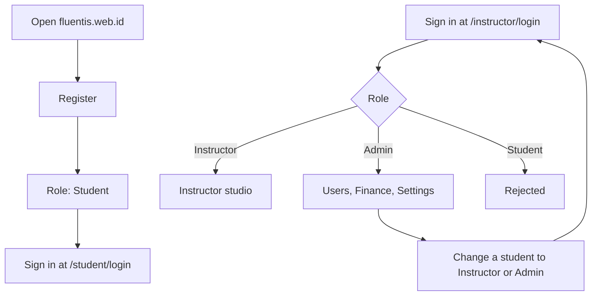
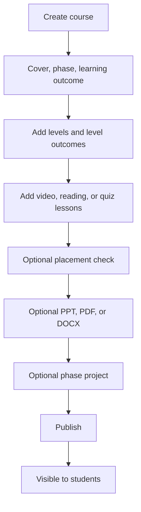
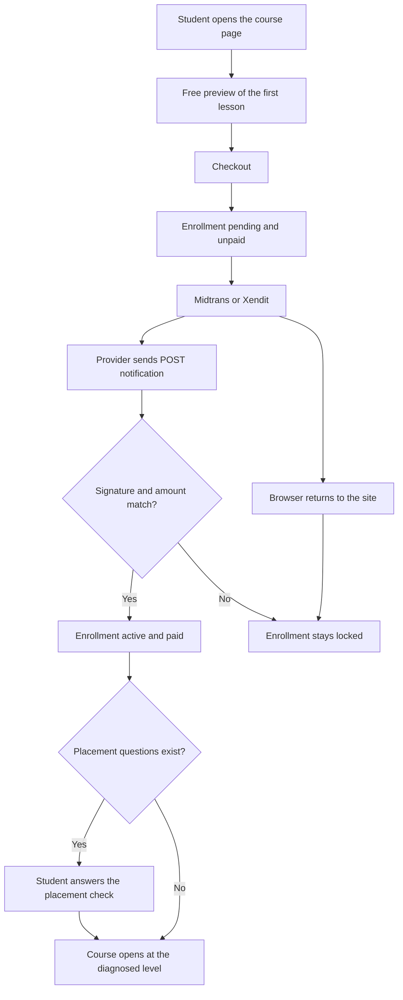
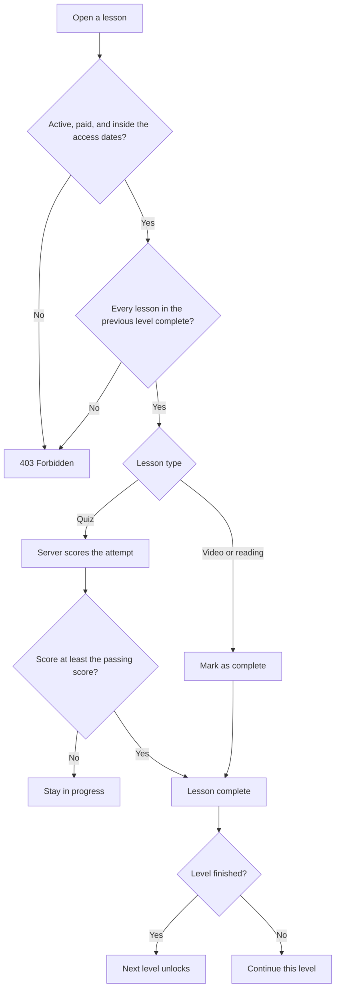
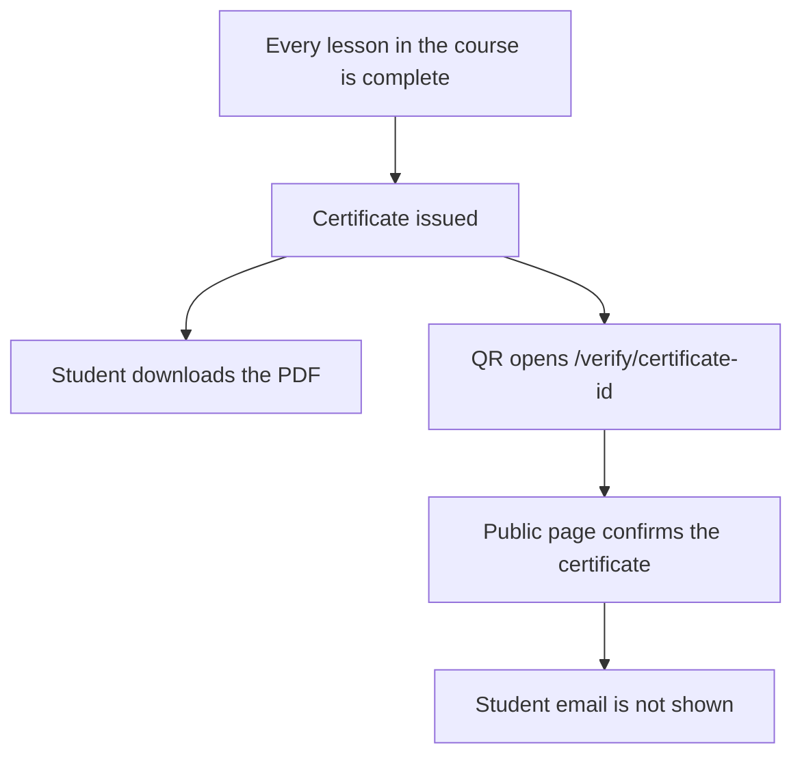
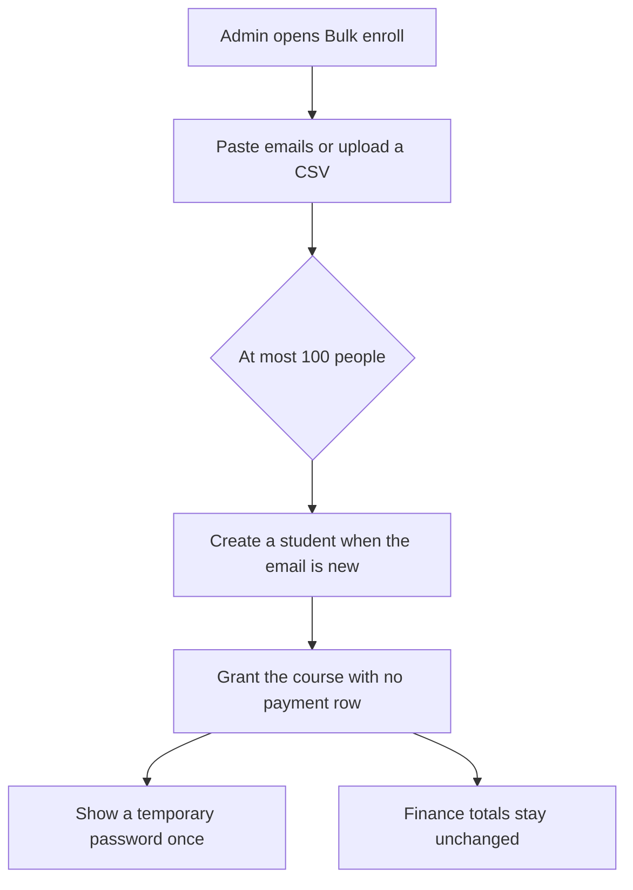

# Process flows

These are the paths Fluentis actually follows. The browser cannot grant course access or skip a level. Both decisions are made by the API.

## 1. Accounts

Public registration always creates a student. The first admin is created on the server, then that admin promotes other people. A student who opens the instructor page is turned away, and an instructor who opens the student page is turned away.

Forgot-password always shows the same message, whether or not the email exists. The reset link lasts 15 minutes. The database stores only a hash of the token.

## 2. Build a course

Level 1 has no prerequisite. Level 2 opens only after every lesson in level 1 is complete, unless a placement check starts the student on a later level. A quiz starts with a passing score of 80 unless the instructor changes it. The answer key is never sent to the student. The placement answer key stays on the server.

## 3. Pay and unlock

The notification URL is `https://api.fluentis.web.id/api/payments/midtrans/notification`. Opening it in a browser does not record a payment. A refund sets the enrollment to cancelled and the payment to refunded. A later failure notice does not remove access that was already paid.

## 4. Learn in order

A quiz that has questions ignores a score typed by the browser. The server shuffles questions and choices, then computes the score. A completed lesson cannot be reopened as incomplete.

A placement check can open the course at a later level. Levels up to that start stay available for review. Every level after the start still waits until the previous level is complete. If the course has placement questions and the student has not answered them, every lesson returns 403.

The phase project opens only after every lesson is complete. The teacher scores that submission. A named class groups enrolled students so the roster can be read one class at a time. Joining a class does not grant access.

Rewards are granted once: 10 XP for a video or reading lesson, 25 XP for a quiz, and 50 XP when a whole level is complete. A quiz score of 90 or more can add a distinction badge. The streak uses the Asia/Jakarta day.

## 5. Certificate

## 6. Company seats

## 7. What each request checks

| Action | Required state |
| --- | --- |
| View the catalog | Published course |
| Open lesson 1 | Student session, enrollment active and paid, current time inside the access window |
| Open a later level | All of the above, plus every lesson in the previous level completed |
| Download a lesson file | Same check as opening that lesson |
| Play video | Same check, then a short-lived HLS playlist |
| Record finance | A real payment row; company seats are excluded |
