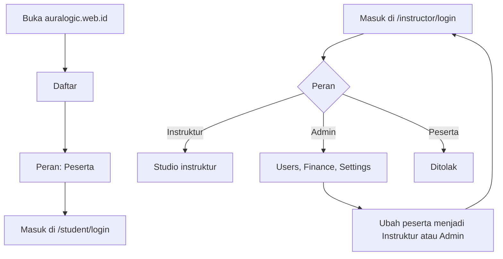
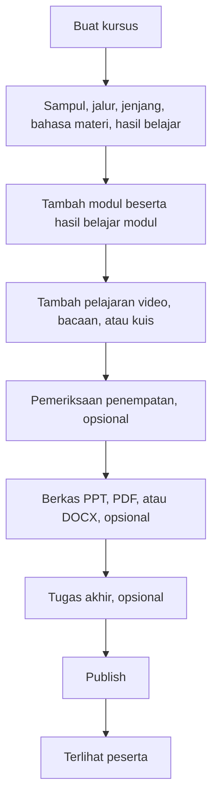
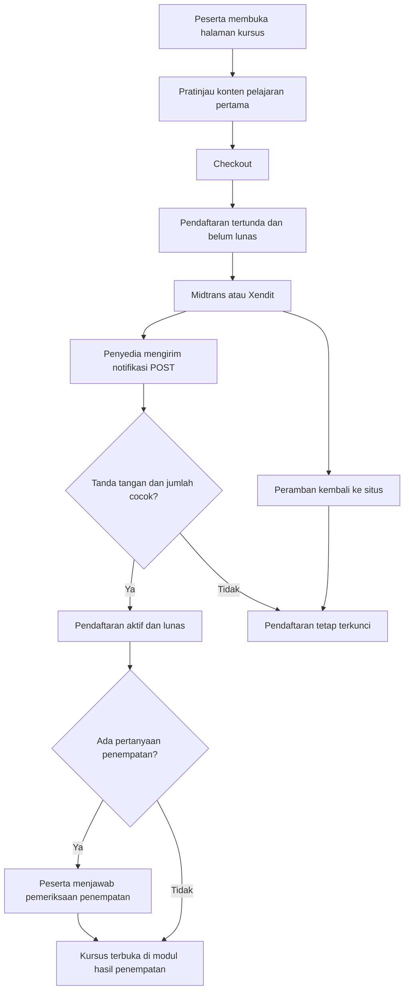
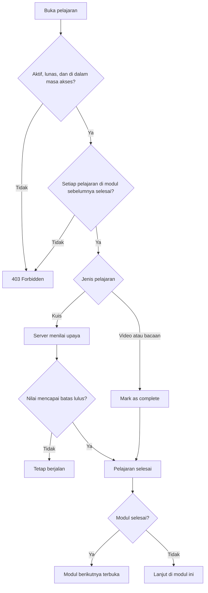
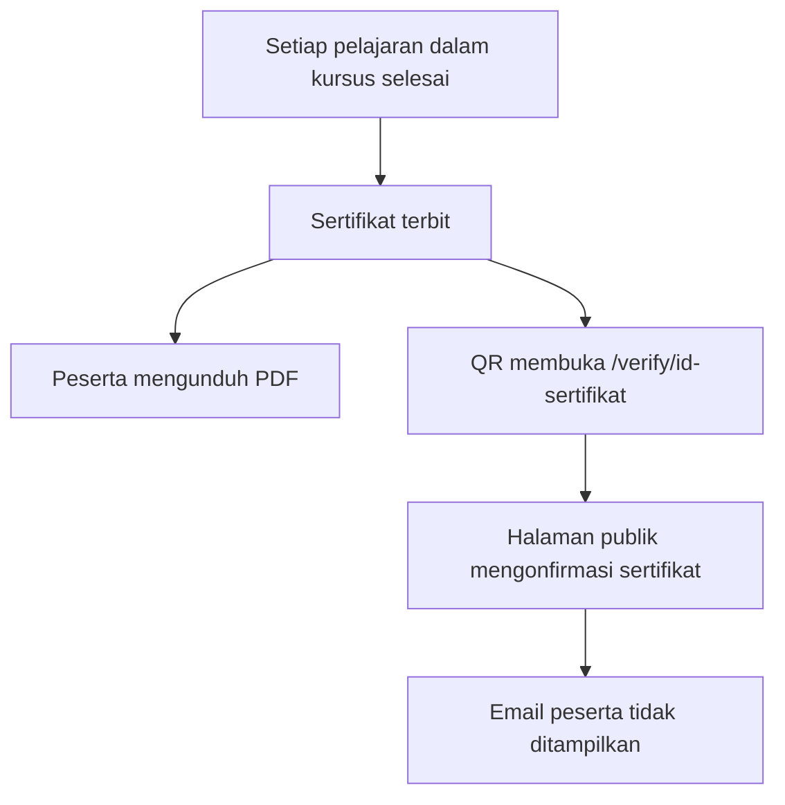
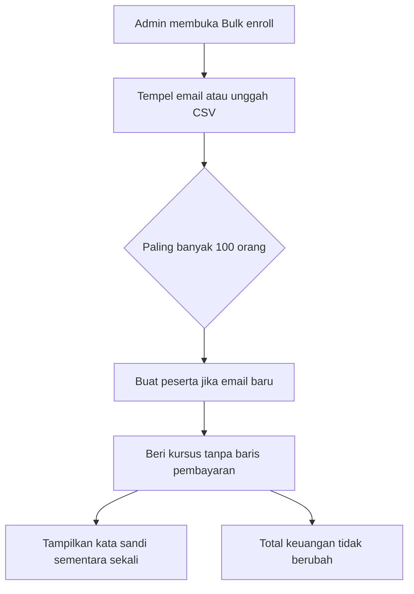

# Alur proses

Ini jalur yang benar-benar diikuti Auralogic. Peramban tidak bisa memberi akses kursus atau melewati modul. Kedua keputusan itu dibuat API.

Satu modul ditampilkan sebagai **Level** di studio dan pemutar. Jenjang kursus (Fondasi, Praktisi, Lanjut) dan jalur (Network, Cybersecurity, Data science, AI, Datacenter) hanya label katalog. Keduanya tidak membuka atau mengunci pelajaran. Aplikasi juga tidak memaksa urutan antar-kursus.

Bahasa antarmuka (cookie `locale`, nilai akun `ID` atau `EN`) terpisah dari bahasa materi kursus. Mengganti bahasa tombol tidak menerjemahkan pelajaran. Edisi bahasa lain adalah kursus pasangan.

## 1. Akun

Pendaftaran publik selalu membuat peserta. Admin pertama dibuat di server, lalu admin itu yang mengangkat orang lain. Peserta yang membuka halaman instruktur ditolak, dan instruktur yang membuka halaman peserta ditolak.

Lupa kata sandi selalu menampilkan pesan yang sama, baik email itu ada maupun tidak. Tautan reset berlaku 15 menit. Basis data hanya menyimpan hash token.

## 2. Susun kursus

Modul 1 tidak punya prasyarat. Modul 2 terbuka hanya setelah setiap pelajaran di modul 1 selesai, kecuali pemeriksaan penempatan memulai peserta di modul yang lebih belakang. Kuis mulai dengan nilai lulus 80 kecuali instruktur mengubahnya. Kunci jawaban tidak pernah dikirim ke peserta. Kunci penempatan tetap di server.

Kursus **DRAFT** tetap di studio dan tidak masuk katalog.

## 3. Bayar dan buka

Pratinjau hanya untuk membaca atau memutar pelajaran 1 di modul 1 pada kursus yang sudah terbit. Menandai selesai, mengirim kuis, dan mengunduh lampiran tetap butuh pendaftaran aktif dan lunas.

URL notifikasi Midtrans adalah `https://api.auralogic.web.id/api/payments/midtrans/notification`. Membukanya di peramban tidak mencatat pembayaran. Pengembalian dana membuat pendaftaran dibatalkan dan pembayaran berstatus refund. Pemberitahuan gagal yang datang kemudian tidak mencabut akses yang sudah lunas.

## 4. Belajar berurutan

Kuis yang punya pertanyaan mengabaikan nilai yang diketik peramban. Server mengacak pertanyaan dan pilihan, lalu menghitung nilai. Pelajaran yang sudah selesai tidak bisa dikembalikan menjadi belum selesai.

Pemeriksaan penempatan dapat membuka kursus di modul yang lebih belakang. Modul sampai modul awal itu tetap tersedia untuk ditinjau. Setiap modul setelahnya tetap menunggu modul sebelumnya selesai. Jika kursus punya pertanyaan penempatan dan peserta yang sudah lunas belum menjawab, setiap pelajaran mengembalikan 403.

Tugas akhir terbuka hanya setelah setiap pelajaran selesai. Instruktur yang memberi nilai. Kelas bernama mengelompokkan peserta yang sudah terdaftar agar daftar bisa dibaca satu kelas. Masuk kelas tidak memberi akses.

Hadiah diberikan sekali: 10 XP untuk video atau bacaan, 25 XP untuk kuis yang lulus, dan 50 XP saat satu modul tuntas. Nilai kuis 90 atau lebih dapat menambah lencana distinction. Streak memakai hari kalender Asia/Jakarta.

Instruktur pemilik kursus dan super admin dapat meninjau pelajaran tanpa membeli dan tanpa menyelesaikan modul sebelumnya.

## 5. Sertifikat

Tugas akhir tidak menjadi syarat terbitnya sertifikat.

## 6. Kursi perusahaan

## 7. Yang diperiksa tiap permintaan

| Tindakan | Syarat |
| --- | --- |
| Lihat katalog | Kursus berstatus terbit |
| Putar atau baca pelajaran 1 modul 1 | Sesi peserta dan kursus terbit. Pembayaran tidak wajib untuk konten ini |
| Tandai selesai, kirim kuis, atau unduh berkas | Sesi peserta, pendaftaran aktif dan lunas, waktu sekarang di dalam masa akses, plus setiap pelajaran di modul sebelumnya selesai |
| Buka modul berikutnya | Syarat yang sama dengan menulis progres |
| Putar video | Syarat konten pelajaran itu, lalu daftar putar HLS yang berumur pendek |
| Pratinjau staf | Super admin, atau instruktur yang memiliki kursus itu |
| Catat keuangan | Baris pembayaran yang nyata. Kursi perusahaan tidak masuk |
